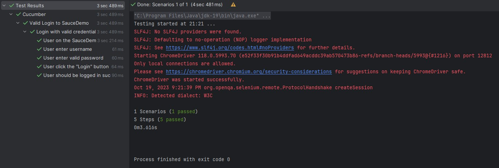
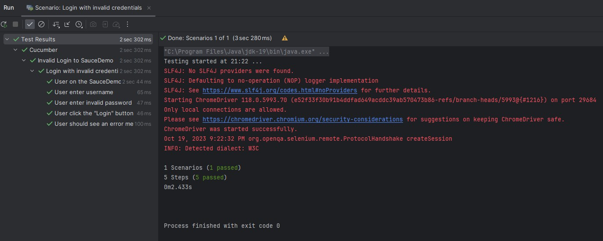
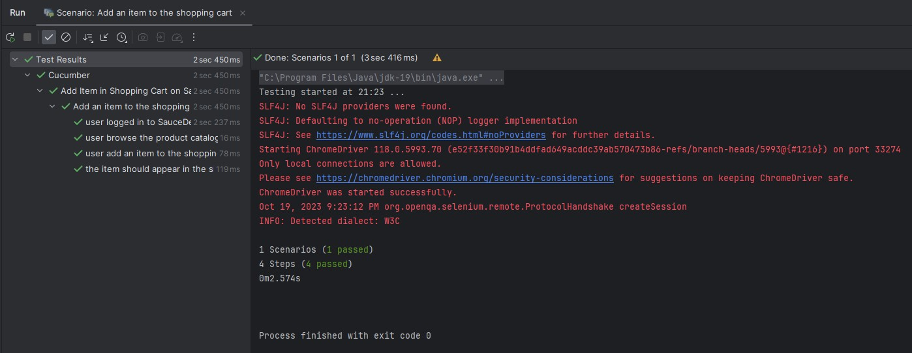
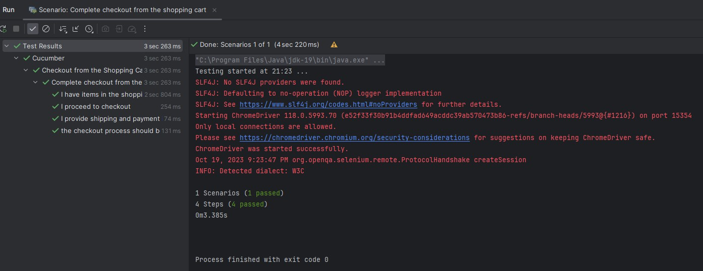

# Test Gherkin Cucumber Java
<p>Profesional Academy (Software Quality Assurance)</p>
9 September 2023 - 22 Oktober 2023

## Link Video
<a href="https://intip.in/demoAutomationTestingAgus"><b>Video Demo Automation Testing</b></a>

## Screenshot Report Automation
1. Valid Login to SauceDemo


2. Invalid Login to SauceDemo


3. Add Item in Shopping Cart on SauceDemo


4. Checkout from the Shopping Cart on SauceDemo


## Requirement
- Java 19.0.2
- Gherkin Cucumber

## File pom.xml
```xml
<?xml version="1.0" encoding="UTF-8"?>
<project xmlns="http://maven.apache.org/POM/4.0.0"
         xmlns:xsi="http://www.w3.org/2001/XMLSchema-instance"
         xsi:schemaLocation="http://maven.apache.org/POM/4.0.0 http://maven.apache.org/xsd/maven-4.0.0.xsd">
    <modelVersion>4.0.0</modelVersion>

    <groupId>org.example</groupId>
    <artifactId>test-gherkin-cucumber</artifactId>
    <version>1.0-SNAPSHOT</version>

    <properties>
        <maven.compiler.source>19</maven.compiler.source>
        <maven.compiler.target>19</maven.compiler.target>
        <project.build.sourceEncoding>UTF-8</project.build.sourceEncoding>
    </properties>

    <dependencies>

        <!-- https://mvnrepository.com/artifact/io.github.bonigarcia/webdrivermanager -->
        <dependency>
            <groupId>io.github.bonigarcia</groupId>
            <artifactId>webdrivermanager</artifactId>
            <version>5.5.3</version>
        </dependency>

        <!-- https://mvnrepository.com/artifact/io.cucumber/cucumber-java -->
        <dependency>
            <groupId>io.cucumber</groupId>
            <artifactId>cucumber-java</artifactId>
            <version>7.13.0</version>
        </dependency>

        <!-- https://mvnrepository.com/artifact/org.seleniumhq.selenium/selenium-java -->
        <dependency>
            <groupId>org.seleniumhq.selenium</groupId>
            <artifactId>selenium-java</artifactId>
            <version>3.141.59</version>
        </dependency>

        <!-- https://mvnrepository.com/artifact/net.masterthought/cucumber-reporting -->
        <dependency>
            <groupId>net.masterthought</groupId>
            <artifactId>cucumber-reporting</artifactId>
            <version>5.4.0</version>
        </dependency>

        <!-- https://mvnrepository.com/artifact/com.opencsv/opencsv -->
        <dependency>
            <groupId>com.opencsv</groupId>
            <artifactId>opencsv</artifactId>
            <version>5.8</version>
        </dependency>

        <dependency>
            <groupId>junit</groupId>
            <artifactId>junit</artifactId>
            <version>4.13.2</version>
            <scope>compile</scope>
        </dependency>

        <!-- https://mvnrepository.com/artifact/io.cucumber/cucumber-junit -->
        <dependency>
            <groupId>io.cucumber</groupId>
            <artifactId>cucumber-junit</artifactId>
            <version>7.14.0</version>
            <scope>test</scope>
        </dependency>

        <dependency>
            <groupId>io.cucumber</groupId>
            <artifactId>cucumber-junit</artifactId>
            <version>7.14.0</version>
            <scope>compile</scope>
        </dependency>

    </dependencies>
</project>
```
